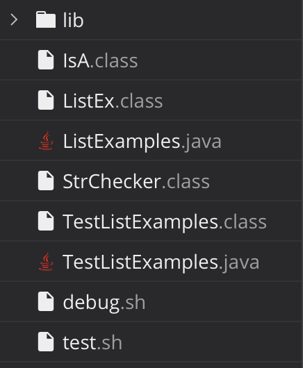

# Lab Report 9

### Student Post

Hi everyone,
I am working on a filter method that is used to extract a certain string from an array list. My tests do not work correctky and I am not getting the expected outputs. I ran ```bash test.sh``` which has the command :
```
javac -g -cp .:lib/hamcrest-core-1.3.jar:lib/junit-4.13.2.jar *.java
java -cp .:lib/hamcrest-core-1.3.jar:lib/junit-4.13.2.jar org.junit.runner.JUnitCore TestListExamples
```
Any thoughts on how to fix this bug? Could it be the structure of the filter method?

```TestExamples.java```
```
import static org.junit.Assert.*; 
import org.junit.*; 
import java.util.Arrays; 
import java.util.List; 
class IsA implements StrChecker {
    public boolean checkString(String s) { 
        return s.equalsIgnoreCase("a"); 
    }
}

public class TestListExamples { 
    
    @Test 
    public void testFilter() { 
        List<String> s1 = Arrays.asList("a", "b", "c"); 
        List<String> s2 = Arrays.asList("d", "a"); 
        
        List<String> expect = Arrays.asList("a"); 
        
        List<String> result1 = ListEx.filter(s1, new IsA()); 
        List<String> result2 = ListEx.filter(s2, new IsA()); 
        
        assertEquals(expect, result1); 
        assertEquals(expect, result2); 
    } 
    
    @Test 
    public void testFilter2() {
        List<String> s1 = Arrays.asList("a", "b", "c"); 
        List<String> s2 = Arrays.asList("d", "a", "a"); 
        
        List<String> expect1 = Arrays.asList("a"); 
        List<String> expect2 = Arrays.asList("a", "a"); 
        
        List<String> result1 = ListEx.filter(s1, new IsA());
        List<String> result2 = ListEx.filter(s2, new IsA()); 
        
        assertEquals(expect1, result1); 
        assertEquals(expect2, result2); 
    }
}
```
```ListEx.java```
```
import java.util.ArrayList;
import java.util.List;

interface StrChecker { boolean checkString(String s); } 

class ListEx {
    
    private static List<String> result = new ArrayList<>(); 
    
    static List<String> filter(List<String> list, StrChecker sc) {
        if(list.size() == 0) { 
            return list; 
        }
        result.clear();
        for(String s: list) {
            if(sc.checkString(s)) {
                result.add(s);
            }
        }
            return result;
        }  
    }
```
Terminal:
```
[user@sahara ~]$ bash test.sh
JUnit version 4.13.2
.E.
Time: 0.006
There was 1 failure:
1) testFilter2(TestListExamples)
java.lang.AssertionError: expected:<[a]> but was:<[a, a]>
at org.junit.Assert.fail(Assert.java:89)
at org.junit.Assert.failNotEquals(Assert.java:835)
at org.junit.Assert.assertEquals(Assert.java:120)
at org.junit.Assert.assertEquals(Assert.java:146)
at TestListExamples.testFilter2(TestListExamples.java:39)

FAILURES!!!
Tests run: 2,  Failures: 1
```
<br> </br>
### TA Post
Hi student! Maybe take a look at where the array you are returning comes from. What does making a variable static do to the variable? Should you be using the same array for each run of the method, or making a new one? Let me know what you try.

### Student Response
Thanks! I figured that using a static variable ```result``` outside of the method would cause the values from previous method usages to remain in the array during subsequent method executions. I changed the result variable to be a local variable in the filter method as well as removed ```results.clear()``` so that instead, a new array list is created for each return. Here is my fixed method:
```
static List<String> filter(List<String> list, StrChecker sc) {
        List<String> result = new ArrayList<>();
        if(list.size() == 0) { return list; }
        for(String s: list) {
            if(sc.checkString(s)) {
                result.add(s);
            }
        }
        return result;
    }
```
Terminal:
```
[user@sahara ~]$ bash test.sh
JUnit version 4.13.2
..
Time: 0.005

OK (2 tests)
```

