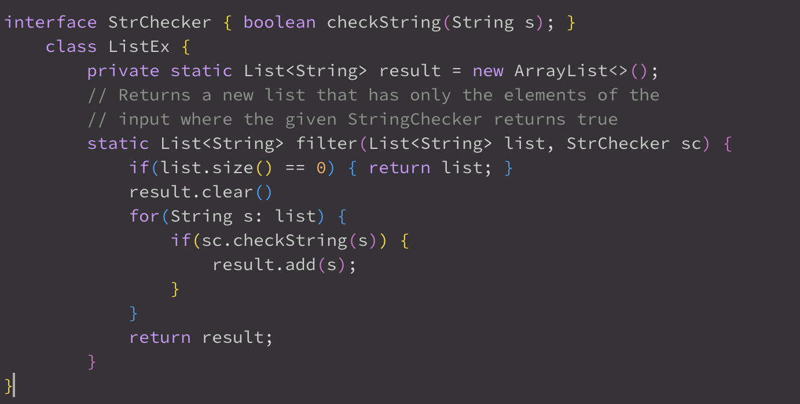

# Lab Report 9

### Student Post

Hi everyone,
I am working on a filter method that is used to extract a certain string from an array list. My tests do not work correctly and I am not getting the expected outputs. I ran ```bash test.sh``` which has the command :

Any thoughts on how to fix this bug? Could it be the structure of the filter method?

```TestExamples.java```

```ListEx.java```

Terminal:
```
[user@sahara ~]$ bash test.sh
JUnit version 4.13.2
.E.
Time: 0.006
There was 1 failure:
1) testFilter2(TestListExamples)
java.lang.AssertionError: expected:<[a]> but was:<[a, a]>
at org.junit.Assert.fail(Assert.java:89)
at org.junit.Assert.failNotEquals(Assert.java:835)
at org.junit.Assert.assertEquals(Assert.java:120)
at org.junit.Assert.assertEquals(Assert.java:146)
at TestListExamples.testFilter2(TestListExamples.java:39)

FAILURES!!!
Tests run: 2,  Failures: 1
```
### TA Post
Hi student! It seems like your second test method is failing. Maybe take a look at where the array you are returning comes from. What does making a variable static do to the variable? Should you be using the same array for each run of the method, or making a new one? Let me know what you try.

### Student Response
Thanks! I figured that using a static variable ```result``` outside of the method would cause the values from previous method usages to remain in the array during subsequent method executions. I changed the result variable to be a local variable in the filter method as well as removed ```results.clear()``` so that instead, a new array list is created for each return. Here is my fixed method:

Terminal:
```
[user@sahara ~]$ bash test.sh
JUnit version 4.13.2
..
Time: 0.005

OK (2 tests)
```
<br> <br/>


## Reflection
Something interesting that I found learning in the second quarter is using jdb. I find it as a helpful tool to fixing my code and I think it is cool that you are able to iterate and run through each line of your code and set stops to see where your code went wrong.
